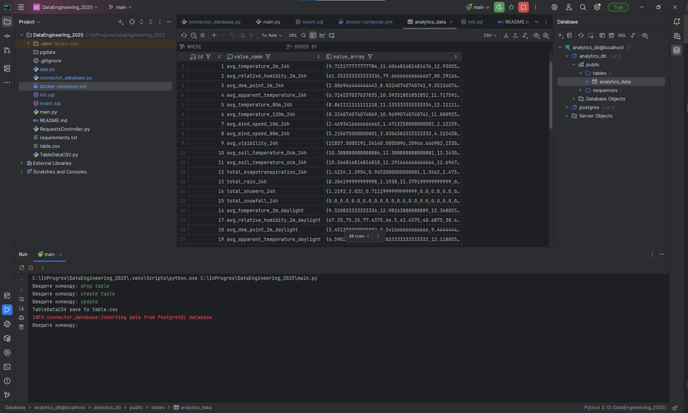
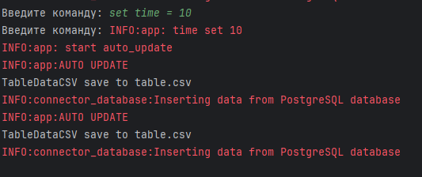

# DataEngineering\_2025

Программа реализует ETL-пайплайн для сбора, трансформации и загрузки прогнозов погоды с помощью API Open-Meteo.

---

## Функциональность

1. **Задание 1: Наивная реализация ETL**

   * Чтение входного JSON в формате Open-Meteo API.
   * Трансформация данных в структуру итоговой таблицы.
   * Сохранение результата в CSV-файл `table.csv`.

2. **Задание 2*: Вставка в базу данных*\*

   * Разворачивание Postgres через `docker-compose.yml`.
   * Скрипты инициализации: `init.sql` (создание базы данных и таблицы) и `insert.sql` (вставка данных).
   * Обработка дубликатов при вставке.

3. **Задание 3*: Выгрузка по запросу*\*

   * Параметризация ETL: указание временного интервала для запроса к API.
   * Выгрузка данных в CSV-файл и в базу данных.

---

## Установка и запуск

1. **Клонировать репозиторий**

   ```bash
   git clone https://github.com/<ваш-пользователь>/DataEngineering_2025.git
   cd DataEngineering_2025
   ```

2. **Создать виртуальное окружение**

   ```bash
   python3 -m venv .venv
   source .venv/bin/activate  # Linux/macOS
   .\.venv\\Scripts\\activate  # Windows
   ```

3. **Установить зависимости**

   ```bash
   pip install --upgrade pip
   pip install -r requirements.txt
   ```

4. **Запустить базу данных Postgres**

   ```bash
   docker-compose up -d
   ```

---

## Команды приложения

Запустить скрипт:

```bash
python main.py
```

Доступны команды:

| Команда          | Описание                                                                               |
| ---------------- | -------------------------------------------------------------------------------------- |
| `exit`           | Завершает работу приложения.                                                           |
| `create table`   | Создаёт таблицу analytics_dataв базе данных                                            |
| `drop table`     | Удаляет таблицу из базы данных.                                                        |
| `update`         | Выполняет ETL: загружает данные, сохраняет в `table.csv` и вставляет в базу данных.    |
| `set time = <n>` | Устанавливает интервал авто-выгрузки в секундах (минимум 5 сек).                       |
|                  | Если `<n> < 5`, применяется порог 5 сек; если `<n> <= 0`, авто-обновление отключается. |

---

## Скриншоты



---

## Лицензия

MIT © 2025

